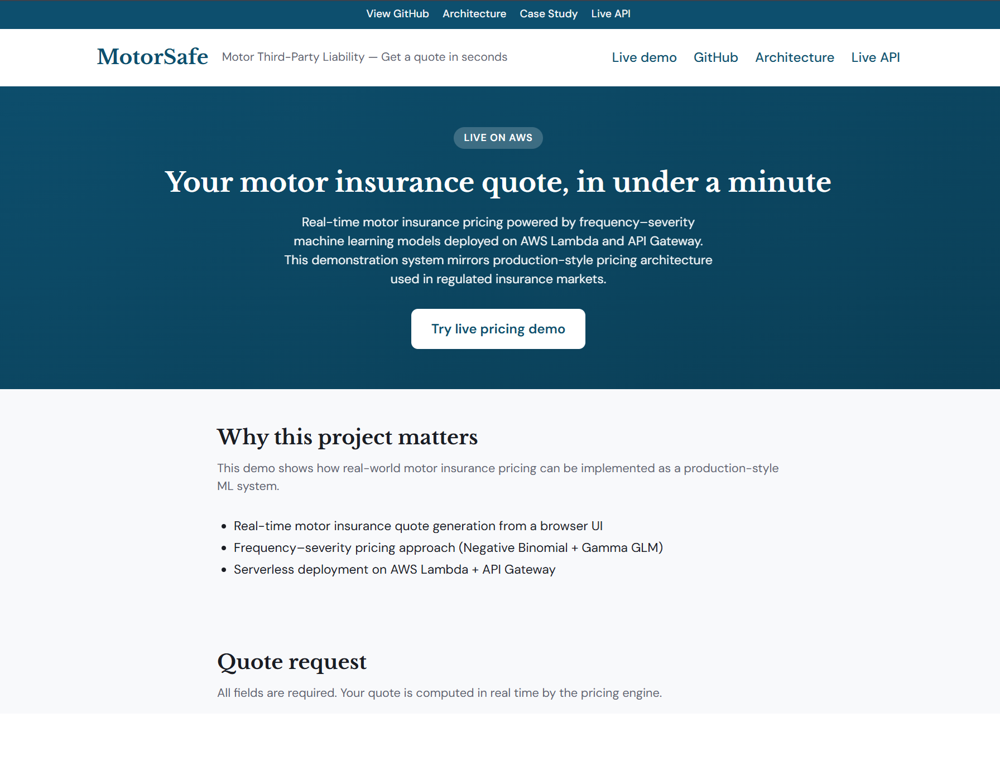
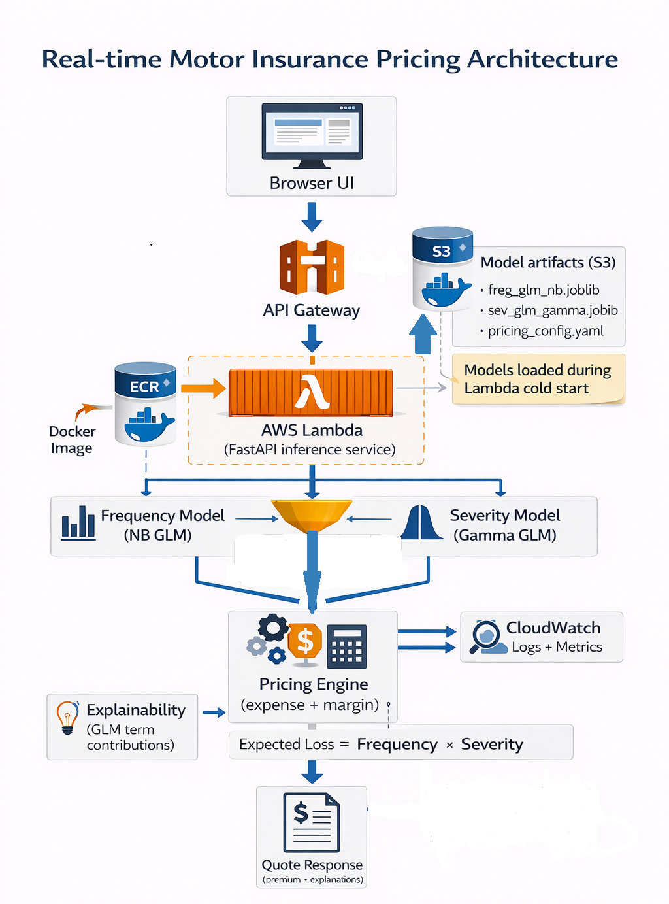

# Motor TPL Pricing Engine  
**Production-Grade Insurance Pricing System (France – freMTPL2)**

An insurance-focused, governance-aware motor third-party liability pricing engine built using the freMTPL2 frequency and severity datasets.

This project demonstrates how actuarial modeling, machine learning, and data governance integrate to produce a reproducible, auditable, and commercially defensible pricing system.

---

## Live demo



- **Web demo**: insurance-style quote UI in `web-demo/index.html` (can be hosted as part of a portfolio site).  
- **Live API** (example): `https://x4lbq3j2if.execute-api.eu-west-2.amazonaws.com/quote` (AWS API Gateway → Lambda).

---

## Executive Summary

This system estimates:

Expected Loss (Pure Premium) =  
E[Claim Count | X, Exposure] × E[Claim Amount | Claim, X]

Then applies pricing rules to generate a gross premium suitable for real-world underwriting environments.

The goal is not just prediction — but **pricing adequacy, stability, and auditability**.

---

## 1. Business Objective

For each policy, the engine produces:

- Expected claim frequency (λ)
- Expected severity (μ)
- Pure premium (λ × μ)
- Gross premium (after expense + margin + caps)
- Structured warnings (out-of-range features, rare categories)

This mirrors how motor pricing systems operate in regulated markets.

---

## 2. System Architecture

```

Raw CSV
↓
Ingest (hash + snapshot + basic checks)
↓
Schema Validation (data contract enforcement)
↓
Staging (controlled transformations & policy rules)
↓
Join (claim-level severity dataset)
↓
Feature Layer
↓
Model Layer (Frequency + Severity)
↓
Pure Premium Calculation
↓
Pricing Engine
↓
API / Batch Rating

```



---

## 3. Data Governance & Contracts

### Raw Layer
- Immutable Parquet snapshots
- SHA256 hashing of inputs and outputs
- Manifest with schema & row metadata

### Schema Validation
- Required columns enforced
- Dtype checks
- Nullability enforcement
- Integer-like validation
- Dataset-level integrity checks

### Business Constraints
- Exposure > 0 (log-offset compatibility)
- Exposure capped at 1.0 (policy-year assumption)
- BonusMalus range monitoring
- Duplicate policy detection
- ClaimAmount strictly positive (severity modeling)

### Join Governance
- Left join with quarantine of unmatched claims
- Matched dataset used for training
- Unmatched claims preserved for audit
- Join diagnostics recorded (match rate, unique missing policies)

---

## 4. Repository Structure

```
src/
  data/
    ingest.py        # Snapshot + manifest
    schemas.py       # Data contracts
    validate.py      # Schema + business rule validation
    staging.py       # Controlled transformations
    joins.py         # Severity dataset builder
  models/
    artifacts.py    # FrequencyModelArtifact, SeverityModelArtifact (formula, factor_levels)
    frequency/
      train.py      # NB GLM with log(Exposure) offset
    severity/
      train.py      # Gamma GLM, optional tail cap
  pricing/
    pure_premium.py   # λ × μ from loaded models; policy → PurePremiumResult
    pricing_engine.py # Gross pricing: pure → gross (config-driven)

configs/
  qc_config.json           # QC thresholds (exposure, match rate, etc.)
  sample_policy.json       # Example policy for quote
  pricing/
    pricing_config.yaml   # Expense, margin, min/max premium, tiering

notebooks/   # 01_data_qc, 02_freq_eda, 03_sev_eda, 04_pricing_adequacy
docs/        # architecture_principles.md
artifacts/   # Models (joblib), reports, model cards
```

---

## 5. Reproducibility & Auditability

Every step produces:

- SHA256 artifact hashes
- Row & column metadata
- Structured JSON reports
- Versioned transformations

This ensures:

- Reproducible training runs
- Full traceability of pricing inputs
- Regulatory defensibility

---

## 6. Running the Pipeline

### 1️⃣ Ingest

```

python -m src.data.ingest 
--freq data/raw/freMTPL2freq.csv 
--sev  data/raw/freMTPL2sev.csv 
--out  data/raw_snapshots 
--manifest artifacts/reports/ingest_manifest.json

```

### 2️⃣ Staging

```

python -m src.data.staging 
--freq-snapshot data/raw_snapshots/<freq>.parquet 
--sev-snapshot  data/raw_snapshots/<sev>.parquet 
--out data/staging 
--report artifacts/reports/staging_report.json

```

### 3️⃣ Validation

```

python -m src.data.validate 
--freq data/staging/freq_staged.parquet 
--sev  data/staging/sev_staged.parquet 
--out  artifacts/reports

```

### 4️⃣ Join (Severity Dataset)

```

python -m src.data.joins 
--freq data/staging/freq_staged.parquet 
--sev  data/staging/sev_staged.parquet 
--out  data/staging/sev_train.parquet 
--report artifacts/reports/sev_join_report.json

```

### 5️⃣ Train frequency model

```
python -m src.models.frequency.train --data data/staging/freq_staged.parquet
```

Outputs: `artifacts/models/frequency/freq_glm_nb.joblib`, metrics, deciles, model card.

### 6️⃣ Train severity model

```
python -m src.models.severity.train --data data/staging/sev_train.parquet --cap-quantile 0.999
```

Outputs: `artifacts/models/severity/sev_glm_gamma.joblib`, `sev_cap.json`, metrics, deciles, model card.

### 7️⃣ Quote pure premium (single policy)

```
python -m src.pricing.pure_premium --policy-json configs/sample_policy.json
```

Uses freq + sev joblib artifacts (and optional `artifacts/models/severity/sev_cap.json`). Returns λ, μ, expected loss, warnings.

### 8️⃣ Gross pricing (pure → gross)

```
python -m src.pricing.pricing_engine --config configs/pricing/pricing_config.yaml --pure <PURE_PREMIUM>
```

Loads `configs/pricing/pricing_config.yaml` (expense_ratio, margin_ratio, min/max_premium, tiering) and returns gross premium with breakdown and config version.

---

## 7. Modeling Strategy (Implemented)

### Frequency
- Negative Binomial GLM with log(Exposure) offset
- Age terms: `bs(DrivAge, df=5)`, `bs(VehAge, df=5)` for nonlinear risk; Density as `log1p_Density`
- Calibration by decile; metrics and model card written to artifacts

#### Model Improvement (Feature Engineering)
The engineered frequency model improves risk segmentation and calibration compared with the baseline GLM. By introducing spline transformations for driver age and vehicle age (`bs(DrivAge)` and `bs(VehAge)`) and applying a log transformation to population density (`log1p_Density`), the model better captures non-linear relationships in key risk factors. Decile analysis shows a significant improvement in risk separation, with lift increasing from approximately **4.8 to 7.0** between the lowest- and highest-risk segments. Calibration also improves, with observed-to-predicted claim frequency ratios remaining close to **1 across most deciles**, indicating better alignment between predicted and actual claim rates. In particular, the top decile now exhibits a substantially higher observed claim frequency (**0.324 vs 0.229 in the baseline**), demonstrating improved identification of high-risk policies and stronger ranking performance for pricing decisions.

### Severity
- Gamma GLM (log link), optional P99.9 cap for training stability
- Same age splines and log1p_Density; factor levels and spline_anchor stored for inference parity
- Decile calibration

### Pure Premium
- λ × μ from loaded models; formula + factor_levels + spline_anchor ensure same design matrix at inference (no pickling of patsy design_info)
- Structured warnings (range, guardrails)

### Gross pricing
- Config-driven: division or multiplicative loadings, min/max caps, optional tiering
- Quote includes breakdown and pricing_config_version for audit

---

## Model performance

**Frequency model (Negative Binomial GLM)**  
- Decent deviance explained on validation (see `artifacts/reports/frequency/*` model cards).  
- Good calibration by decile (obs/pred ≈ 1 across most deciles).

**Severity model (Gamma GLM)**  
- Gamma GLM with log link and optional tail cap at P99.9.  
- Mean absolute error and calibration diagnostics are written to `artifacts/reports/severity/*` model cards.

---

## Serving latency & monitoring

**Latency (online quoting)**  
- Inference latency for the deployed Lambda + API Gateway stack is typically on the order of **~120 ms per quote** (excluding cold starts), which is suitable for real-time quoting flows.

**Monitoring (CloudWatch)**  
The pricing service is designed to emit operational metrics to AWS CloudWatch, including:

- Request latency
- Quote decisions (BIND / REFER)
- Prediction distribution (frequency and severity)
- API error rate

These metrics can be used to monitor model behaviour, track premium stability, and detect drift in production environments.

---

## Model governance

This project treats pricing as a governed asset rather than just a model file:

- **Training dataset**: freMTPL2 frequency and severity tables.  
- **Training date**: e.g. `2026-02-26` for the current production run.  
- **Model types**:
  - Frequency: Negative Binomial GLM with log(Exposure) offset.
  - Severity: Gamma GLM with log link.
- **Config-driven pricing**: `configs/pricing/pricing_config.yaml` controls expense, margin, min/max premium, and tiering.
- **Versioned artifacts**: `src/pricing/quote_service.py` records:
  - Git commit hash
  - Model artifact paths and SHA256 hashes
  - Pricing config path, version, and SHA256

Each quote therefore carries enough metadata (via `model_version` and `config_version`) to be audited and reproduced.

---

## 7.1 Comparing model performance (before vs after feature engineering)

To compare performance **before** and **after** a change (e.g. log1p(Density) or bs(DrivAge/VehAge) splines):

1. **Save the current run as baseline** (before changing the model):
   - Copy the report outputs so they are not overwritten, e.g.:
     - `mkdir -p artifacts/reports_baseline && cp -r artifacts/reports/frequency artifacts/reports_baseline/` (and same for `severity` if needed).
   - Or: train the **old** model (e.g. with `Density` in the formula), then copy `artifacts/reports` to `artifacts/reports_baseline`.

2. **Train the new model** (e.g. with `log1p_Density`). This overwrites `artifacts/reports/frequency/` (and severity if you run severity training).

3. **Run the comparison script:**
   ```bash
   python scripts/compare_model_runs.py --before artifacts/reports_baseline --after artifacts/reports
   ```

The script prints:
- **Metrics**: `abs_rate_error_val`, `mae_log1p`, AIC, deviance, etc. (lower error / lower AIC = better).
- **Decile calibration**: `obs_over_pred` by decile (closer to 1.0 = better); and mean absolute deviation from 1.0 (MAD).

Use this to confirm that the new feature engineering improves or does not harm calibration and error metrics.

---

## 8. Commercial Relevance

Unlike notebook-style Kaggle projects, this system:

- Separates frequency and severity (actuarial standard)
- Uses exposure offsets correctly
- Implements governance-aware joins
- Tracks pricing inputs for audit
- Supports both real-time and batch scoring
- Designed for regulatory defensibility

This aligns with real-world pricing environments in UK and EU motor markets.

---

## 9. CI/CD & Model Governance (Planned)

- Schema validation as CI gate
- Drift monitoring (input + premium stability)
- Versioned model artifacts
- Versioned pricing configuration
- Reproducible retraining pipeline

---

## 10. Status

✅ Data ingestion & governance complete  
✅ Modeling layer (frequency NB + severity Gamma) complete  
✅ Pure premium engine (policy → λ×μ) complete  
✅ Gross pricing engine (config-driven, YAML) complete  
⏳ API / batch rating (planned)  
⏳ CI gate + drift monitoring (planned)
